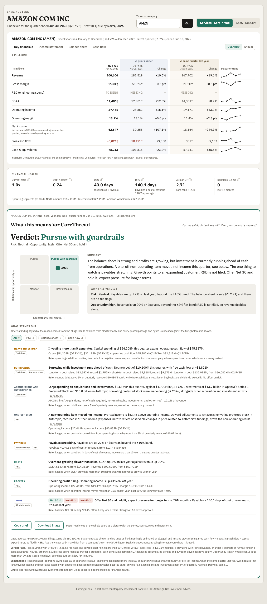
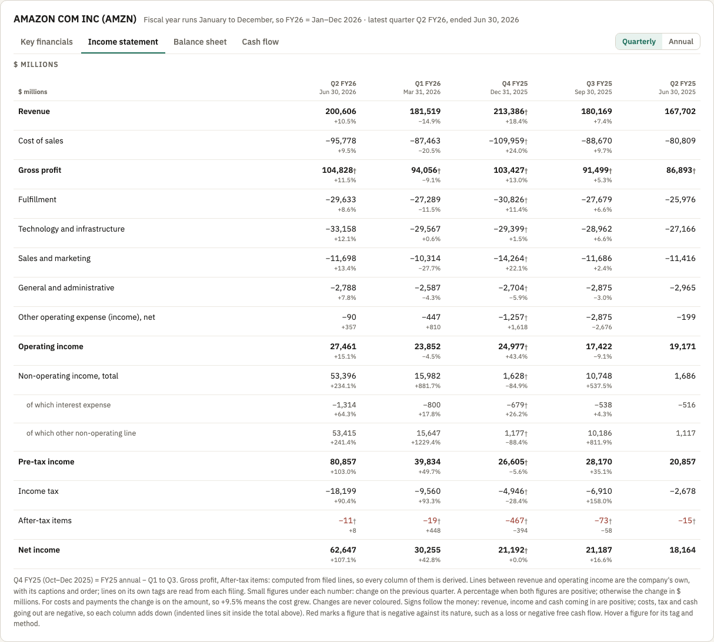
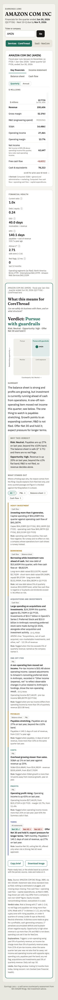

# Earnings Lens

**Live: https://earnings-lens-sigma.vercel.app**

A ticker in, a counterparty verdict and payment terms out.

Type any US-listed ticker (or a company name). The app pulls that company's
filings from SEC EDGAR, runs a fixed set of rules over the filed figures, and
shows what the numbers mean for doing business with them: a verdict on a
two-axis matrix, the reasons that decided it, a short written commentary on
what it means, the handful of things that stand out in the figures, and the
payment terms that follow. Beside it sit the company's own statements --
the income statement as it presents it, the balance sheet and the cash flow
-- for five quarters or three fiscal years. The credit exposure and the GTM
handover travel with the Copy brief, for the readers who need them.

The same company is read through two lenses:

| | CoreThread (services) | NexCore (SaaS) |
|---|---|---|
| **The question** | Can we safely do business with them, and on what structure? | Can they become a durable, expanding customer? |
| **Billing** | Monthly, in arrears | Annual, in advance |
| **So the exposure is** | About two months of billing | The invoice window on the annual fee |

**CoreThread and NexCore are fictional companies**: a services firm and a
SaaS vendor, standing in for two kinds of seller. They exist to make the point
that a counterparty assessment is not a property of the counterparty alone:
the same balance sheet, the same payables trend and the same growth produce a
different deal depending on who is selling and how they bill.



Amazon, read as a counterparty in the quarter ended 30 June 2026. The board
opens with the verdict, and the two lines that decided it:

> ## Verdict: Pursue with guardrails
> Risk: Neutral · Opportunity: high · Offer Net 30 and hold it
>
> **Why this verdict**<br>
> **Risk: Neutral.** Payables are up 27% on last year, beyond the ±10% band.
> The balance sheet is safe (Z'' 2.71) and there are no red flags.<br>
> **Opportunity: high.** Revenue is up 20% on last year, beyond the ±2% flat
> band; R&D is not filed, so revenue decides alone.

Beside them, the Summary says what it means in one paragraph:

> The balance sheet is strong and profits are growing, but investment is
> currently running ahead of cash from operations. A one-off non-operating item
> moved net income this quarter; see below. The one thing to watch is payables
> stretching. Growth points to an expanding customer; R&D is not filed. Offer
> Net 30 and hold it; expect pressure for longer terms.

Then the seven things the rules found worth saying, before the payment terms.
Where the filing says why, its reason closes the finding, with a citation:

| | |
|---|---|
| **HEAVY INVESTMENT** | **Investing more than it generates.** Capital spending of $54,208M this quarter against operating cash flow of $45,387M.<br>*Capex $54,208M (Q2 FY26), $32,183M (Q2 FY25) · operating cash flow $45,387M (Q2 FY26), $32,515M (Q2 FY25)* |
| **BORROWING** | **Borrowing while investment runs ahead of cash.** Net new debt of $10,600M this quarter, with free cash flow at −$8,821M.<br>*Long-term debt raised $13,557M, repaid $2,752M · short-term debt raised $9,368M, repaid $9,573M · long-term debt $132,995M, from $56,082M in Q2 FY25* |
| **ACQUISITIONS AND INVESTMENTS** | **Large spending on acquisitions and investments.** $24,359M this quarter, against $1,700M in Q2 FY25. Investments of $13.7 billion in OpenAI’s Series C Preferred Stock and $10.0 billion in Anthropic nonvoting preferred stock were made during Q2 2026, alongside other acquisition and investment activity. <sub>10-Q, MD&A</sub><br>*AMZN's line: "Acquisitions, net of cash acquired, non-marketable investments, and other, net" · 12.1% of revenue* |
| **ONE-OFF ITEM** | **A non-operating item moved net income.** Pre-tax income is $53.4B above operating income. Upward adjustments to Amazon's nonvoting preferred stock in Anthropic, recorded in "Other income (expense), net" to reflect observable changes in price related to Anthropic's fundings, drove the non-operating result. <sub>10-Q, Notes</sub><br>*Operating income $27,461M · pre-tax income $80,857M (Q2 FY26)* |
| **PAYABLES** | **Payables stretching.** Payables are up 27% on last year, beyond the ±10% band.<br>*Payables ≈ 140.1 days of cost of revenue, from 110.7 a year ago* |
| **COSTS** | **Overhead growing slower than sales.** SG&A up 1% on last year against revenue up 20%.<br>*SG&A $14,486M, from $14,381M · revenue $200,606M, from $167,702M* |
| **PROFITS** | **Operating profit rising.** Operating income is up 43% on last year.<br>*Operating income $27,461M, from $19,171M in Q2 FY25 · margin 13.7%, from 11.4%* |
| **TERMS** | Net 30 ✓ · Net 45 ✕ · Net 60 ✕ — **Offer Net 30 and hold it; expect pressure for longer terms.** T&M monthly. Payables ≈ 140.1 days of cost of revenue, up 27% on last year. |

Each finding carries small tags for the statements it reads -- Cash flow,
Balance sheet, P&L, or Filings for a red flag or a restructuring 8-K -- and a
tag opens that statement's tab. Chips above the list filter the findings by
statement (All 7, P&L 4, Balance sheet 2, Cash flow 3 here); the terms and
any red flag stay visible under every filter, so a filter never hides a
reason to escalate. Borrowing, acquisitions and investments, and returns
(buybacks plus dividends above free cash flow) are display only: they never
move the ladder or the quadrant and are not in the Summary.

On the page every finding also ends with its rule, e.g. for the one-off item:
*Rule: flagged when pre-tax income differs from operating income by more than
5% of quarterly revenue ($10.0B here).* The citation opens, on hover or tap,
to the filing date, the section, the accession number and the passages the
sentence was checked against. The filing gives no reason for the payables
move, so that finding ends at its own sentence.

Every figure there is filed. Amazon's free cash flow is negative this
quarter, and the rules deliberately do not call that burning cash: $45bn came
in from operations and $54bn went out to capital, so nothing is running out
and no runway is quoted. A company whose *operations* consume cash is a
different case with a different item and a real runway behind it — Rivian, in
the same set of fixtures. Same negative number, opposite meaning.

### The statements



Above the board, the financials panel names the company and its fiscal year
-- "Fiscal year runs January to December, so FY26 = Jan–Dec 2026", taken from
EDGAR's fiscal year end and the filer's own 10-K period ends, because a
company's FY26 or Q4 is not the calendar's -- and the board's identity line
repeats it ("fiscal year Jan–Dec"). Four tabs share one Quarterly / Annual
toggle: Key financials, Income statement, Balance sheet and Cash flow.

- **The income statement is the company's own.** Every line between revenue
  and operating income is read from each filing's instance and linkbases, in
  the latest filing's order and with its captions -- including lines on the
  company's own tags, like Amazon's Fulfillment and Technology and
  infrastructure, which company facts never carries. Signs come from the
  calculation linkbase, company subtotals are left out, and the standard rows
  around the lines (revenue, gross profit, operating income, non-operating
  income with its interest and other lines, pre-tax income, tax, after-tax
  items, net income) keep standard names.
- **The balance sheet and cash flow are standard lines**, resolved from company
  facts the way Key financials is: cash through total equity; operating cash
  flow, capital expenditures and free cash flow; acquisitions (named as the
  company names the line), investment purchases and sales; every debt line
  the filer uses, net new debt, buybacks and dividends.
- **Signs follow the money.** Income and cash coming in are positive; costs,
  tax and cash going out are negative, so each column adds down. XBRL files
  payments as positive amounts; the sign is applied at display only. Red is
  kept for a figure negative against its nature -- a loss, negative free cash
  flow, a non-operating loss.
- **The change sits under each figure**, on the previous quarter or fiscal
  year: a percentage when both figures are positive, otherwise the change in
  dollars, never coloured.
- **One presentation per column.** Every row in an income statement column
  comes from the latest-filed statement that presents that period. Where a
  standard row then differs from Key financials, the cell is marked restated,
  with the original on hover.
- **The tabs never hold up the board.** They load after it; the first time a
  filing is read the panel says "Reading filing 3 of 8", one filing per
  request, and each filing's extract is stored so it is read once.

## How it works

```
ticker → SEC EDGAR → rules → verdict, why, Summary, what stands out, terms
                              └→ Claude explains the flagged items, inside their findings
```

1. **EDGAR.** XBRL company facts supply the figures; the submissions feed
   supplies the filing list, 8-K item numbers, the filer category and the
   fiscal year end. Segment revenue and the income statement's own lines come
   from each filing's XBRL instance and linkbases, found through the filing
   index, because the aggregated APIs strip dimensional facts and company
   tags.
2. **Rules.** Fixed, declared rules turn those figures into signals (revenue
   and R&D growth, payment behaviour, spending cuts, red-flag filings), an
   Altman Z'' score, a cash position (a burn, with a runway of cash plus
   short-term investments over the burn, when operations consume cash; heavy
   investment, with none, when capital spending outruns positive operating
   cash flow), a payment-terms ladder, a matrix position
   and a deal structure. Nothing here is a model output. Given the same
   filings and the same date, it returns the same answer.
3. **Verdict and why.** The board opens with the verdict in large type and one
   line under it: the risk rung (with "with spending cuts" when a restructuring
   filing or an R&D or SG&A cut puts the company in the higher-risk half of the
   matrix), high or low opportunity, and the terms. Beside the matrix, "Why
   this verdict" gives the input that decided each axis, with its figure —
   payables up 27%, Z'' 2.71, revenue up 20% — using the rules' own values.
   The rules themselves are in the board's footnotes.
4. **Summary.** The Summary beside the matrix is commentary, templated from
   the rules' own output and carrying no ratio values. The verdict is its
   first part; on the page it starts at the second, because the verdict is
   already above it (the Copy brief keeps it). In order: the verdict;
   the balance sheet as strong, in the grey zone or distressed (the zone after
   the distress cap, so never "cash-rich" — Z'' is not a cash measure); which
   way operating income is moving, called "fast" only past 50% year on year;
   the cash position — a runway in years or quarters when operations are
   burning cash, or "investment is currently running ahead of cash from
   operations" when capital spending outruns positive operating cash flow; a
   one-line pointer ("see below") when a one-off tax item or non-operating
   item moved net income; the one thing to watch; what it means
   for the relationship; and the terms. The first three form one sentence,
   joined with "and" or "but". The figures stay in the table, the health
   tiles and "What stands out".
5. **What stands out.** Rule-based observations about how the figures relate
   and move, not their levels — a red flag, cash burn with its runway or heavy
   investment with none, borrowing, acquisitions and investments, returns, a
   one-off item, spending cuts, payables stretching, overhead outrunning
   sales, losses or profits turning, gross margin moving, and payment terms,
   which are always the last item. Each appears only when
   its declared threshold fires; each carries one headline, one sentence, the
   figures behind it and a "Rule:" line stating the threshold that fired.
   The **one-off item** appears when something below operating income moved
   net income: pre-tax income more than 5% of quarterly revenue away from
   operating income; income tax more than 5% of quarterly revenue away from
   21% of pre-tax income, when the same quarter last year was not also that
   far away (a tax position that repeats every year, such as a full valuation
   allowance, is not a one-off); or net income and operating income with
   opposite signs.
6. **Claude.** One job the rules cannot do: say *why*, from the filed text,
   for the specific items the rules flagged. The answer is the finding's own
   closing sentence, followed by a small citation (form and section, e.g.
   "10-Q, MD&A").

### What Claude does, and what it is not allowed to do

Claude is asked a narrow question per flagged item and is given only filed
text to answer it from: the results 8-K with all of its exhibits (press
release, and CFO commentary or prepared remarks when a company files them),
the latest 10-Q or 10-K management discussion and notes, a Form 12b-25
late-filing notice, and any 8-K behind a flag.

Every answer comes back with the verbatim passages it relied on, and the app
checks them before anything is shown:

- each quoted passage must appear in the cited document, whitespace-normalised;
- every figure in a sentence must appear in one of those quoted passages, in
  exactly that form — so converting "7,772" into "$7.8 billion" fails the
  check;
- no sentence may restate a verdict, a payment term or a computed metric.

A sentence that fails any of these is dropped, not corrected. Because the
answer closes a finding the reader has just read, Claude is also shown that
finding's sentence and figures and told to leave them out: the answer starts
with the cause, never restates the gap or any figure already shown, and is
one sentence, two at most. If the filing gives no reason, or nothing survives
the check, the finding simply ends at its own rule-based sentence. **Claude
never computes a number and never decides anything.** The verdict, the terms
and every figure on the page come from the rules.

Answers are cached per filing and trigger, under a version number that is
bumped whenever the prompt changes, so every stored answer is regenerated
under the current instructions.

The page is complete without Claude. With the layer disabled, the API key
absent, the daily cap reached, or the call failing, every finding still
renders in full, without the closing sentence, and everything else renders
exactly as before.

## Design principles

- **A missing value stays missing.** A figure that isn't filed is shown as
  missing — never zero, never estimated. Anything that depends on it is
  missing too (free cash flow without capex).
- **One tag per row.** Each line item uses one XBRL tag across all five
  quarters, chosen by a declared priority order. A cell may come from a second
  tag only once the two are shown to agree within $1M in the most recent
  period both report, with at least one of the two values non-zero, and it is
  marked as spliced when it does; the same proof lets a quarter be one tag's
  year-to-date figure less the other's prior one. Every cell carries its own
  tag, method and derived flag.
  - **Joins.** An income statement line whose element changes between filings
    is one line only when both elements report the same value (within $1M) in
    the most recent period they share, across every fact in the filings, not
    only the statement's.
  - **Two zeros never prove anything.** A splice, a join, a formula switch or
    a debt total needs a non-zero value to rest on.
  - **The latest presentation wins.** When a company restates or reclassifies
    a period, every cell for it comes from the latest filing that presents it,
    so a moved cost is never counted twice.
  - **A derived payment can't be negative.** A payment or proceeds quarter
    derived by subtraction that comes out negative means the filings don't
    reconcile; it shows MISSING, and so does everything computed from it.
- **Declared values are on the page.** Every threshold the rules use — the
  Z'' zones, the growth band, the payables band, the payment-terms ceiling,
  the two runway thresholds and the rule that decides between a cash burn and
  heavy investment, the "What stands out" thresholds, the explanation
  triggers, the daily call cap — is printed on the page, in the board's
  footnotes or on the finding it governs, so a reader can check
  the verdict against the rule that produced it. So is the one place the rules
  override a published score: Z'' punishes accumulated deficits and
  buyback-driven negative equity, so a profitable, cash-generating company
  scoring in the distress zone is read as grey rather than distressed, and the
  page says so where it happens. The page reads them from the
  same constants the rules do, so the two can never disagree.
- **Quotes are verified, not trusted.** See above. The check runs on every
  sentence, every time, and the test suite includes a deliberately altered
  quote to prove it is dropped.
- **A percentage only when both figures are positive.** Otherwise the change
  is shown in dollars.
- **No judgement words.** Every line states a fact about the filings
  ("Overhead growing faster than sales. SG&A up 30% on last year against
  revenue up 12%."), never an inference about demand, intent or what they
  might buy.



## Data sources and limits

Everything on the page comes from SEC EDGAR. Nothing comes from a news feed, a
price feed or a data vendor.

- **US filers only.** The app reads US GAAP XBRL from EDGAR; a foreign private
  issuer filing a 20-F is out of scope.
- **No earnings-call transcripts.** Transcripts are not filed with the SEC and
  are usually licensed by a third party, whose terms generally forbid
  reproducing quotes — and inconsistent vendor text would defeat the verbatim
  quote check. When a company *files* its prepared remarks or call script as an
  exhibit, that is filed text and is read like any other exhibit.
- **Going concern is not checked.** Filers do not tag it: a company with
  going-concern language in its 10-K had no going-concern tag anywhere in its
  XBRL instance — the paragraph is untagged prose. Scanning prose is out of
  scope, so the red-flags count is never presented as a clean going-concern
  check: the tile's own explanation and the board's footnotes both say it was
  not checked.
- **Company-extension XBRL tags are read on the income statement only.** Its
  lines come from each filing, own tags included. The balance sheet, the cash
  flow and Key financials use standard tags only, because company facts
  exposes nothing else: a filer that moves a line to its own tag there shows
  that cell as MISSING ("filed under the company's own tag") rather than
  wrong.
- **No stock prices.** The Altman Z'' variant used here is the book-equity one,
  which needs no market capitalisation.
- **Red flags are a live, trailing-12-month window from today**, not from the
  reporting period, so the same quarter can produce a different result later.
  That is intended.
- **Not investment advice.** It is a counterparty assessment for commercial
  terms, not a view on a security.

## Running it locally

```bash
npm install
cp .env.example .env.local   # then fill in the values
npm run db:apply             # creates the tables in db/schema.sql
npm run dev
```

Three environment variables, by name (`.env.example` documents each; none of
them ever belongs in the repo):

| Variable | What it is for |
|---|---|
| `EDGAR_CONTACT_EMAIL` | SEC's fair-access policy requires a contact email in the User-Agent on every EDGAR request. |
| `DATABASE_URL` | Postgres (Neon). Holds the explanation cache, the daily call count and per-filing segment data. The pooled connection string is all that is needed. |
| `ANTHROPIC_API_KEY` | The explanation layer. Without it the app runs, and every finding renders without its closing explanation. |

Optional: `CLAUDE_ENABLED=false` turns the explanation layer off outright,
`CLAUDE_MODEL` overrides the model, `CLAUDE_DAILY_CAP` overrides the declared
cap of 50 calls a day.

The default model is `claude-opus-5`: the job is strict verbatim extraction
under a quote check, where a weaker model's paraphrasing shows up as dropped
sentences and an unexplained item, and per-filing caching means a company is
only ever read once, so the stronger model costs little.

## Testing

```bash
npm run check
```

That runs the type check, the linter, the filing-deadline unit tests (every
filer category × 10-Q/10-K × normal and 52/53-week fiscal years), the cash
tests (a burn versus heavy investment, including operating cash flow of
exactly zero or unfiled; which burn measure the runway divides by; and the two
thresholds that cap the payment-terms ladder), the quote verification tests
including the altered-quote case, the ladder tests (every Altman zone × red
flag × payables trend × runway, and the distress cap), the fiscal-calendar and
debt-window tests, the one-off item tests (each trigger alone and all three
together, the unusual-tax repeat rule, and the wording and precision the board
shows), the resolution tests (the nil rule, splice recency, cross-tag
year-to-date subtraction, zeros proving nothing, negative derived payments),
a footing test that checks every income statement column of every fixture
adds up to operating income, a restated check that lists every income
statement cell whose presentation differs from Key financials, and three
snapshot diffs over thirteen real companies — one over every Key financials
figure with its full provenance, one over every rules output, one over every
statement cell. All report per-cell and per-field changes, so a change in
what EDGAR returns shows up as a diff rather than as a quietly different
verdict.

The thirteen are chosen so that between them they exercise every branch worth
exercising: a derived Q4 from a just-filed 10-K (MSFT, FDX), an operating loss
whose change reads in dollars (SNAP, RIVN), a cash burn with a runway figure
(RIVN), heavy investment with none (AMZN, GOOGL), a one-off non-operating
item (NVDA, AMZN, GOOGL, UBER, ZM), a tax position that repeats from a year
earlier and so is not a one-off (RIVN), a company with no debt tagged (ZM), a
restructuring filing (FDX, SNAP), the grey zone (WMT, TGT), the one path from
grey to Weak (TGT) and the Altman distress cap (UBER). Where no real filer
reaches a rule, the rule gets unit tests instead of a ticker — the two runway
thresholds, a first-year unusual tax item and net income against operating
income with opposite signs are in that position. A rule nothing exercises is a rule
nothing checks.

The phone layout is checked separately, because it needs a browser:
`node scripts/screenshots.mjs http://localhost:3000` opens the board at 375px in
both Chromium and WebKit, for AMZN, RIVN and NAII on both lenses, and fails if
any element inside the board extends past its right edge — before it takes a
single screenshot, so a broken layout never reaches the README. Add
`--check-only` to run the check without the screenshots.

Other commands:

| Command | What it does |
|---|---|
| `npm run explain-report -- NVDA` | The whole Claude layer for a ticker: triggers, sources read, explanation, citation, verified passages, what was dropped, tokens spent. |
| `npm run audit-explanations` | Re-fetches every cited filing and re-verifies every stored explanation from scratch. Makes no Claude call. |
| `npm run snapshot` / `npm run rules-snapshot` / `npm run statements-snapshot` | Regenerate the snapshot baselines (never without reviewing the diff). |

---

Built with [Claude Code](https://claude.com/claude-code) from my own written
spec (`Earnings_Lens_Build_Spec.md`). The visual target is
`Earnings_Lens_Statements_Mock.html` (v1.5): the statement tabs, the lens
board and its findings.
